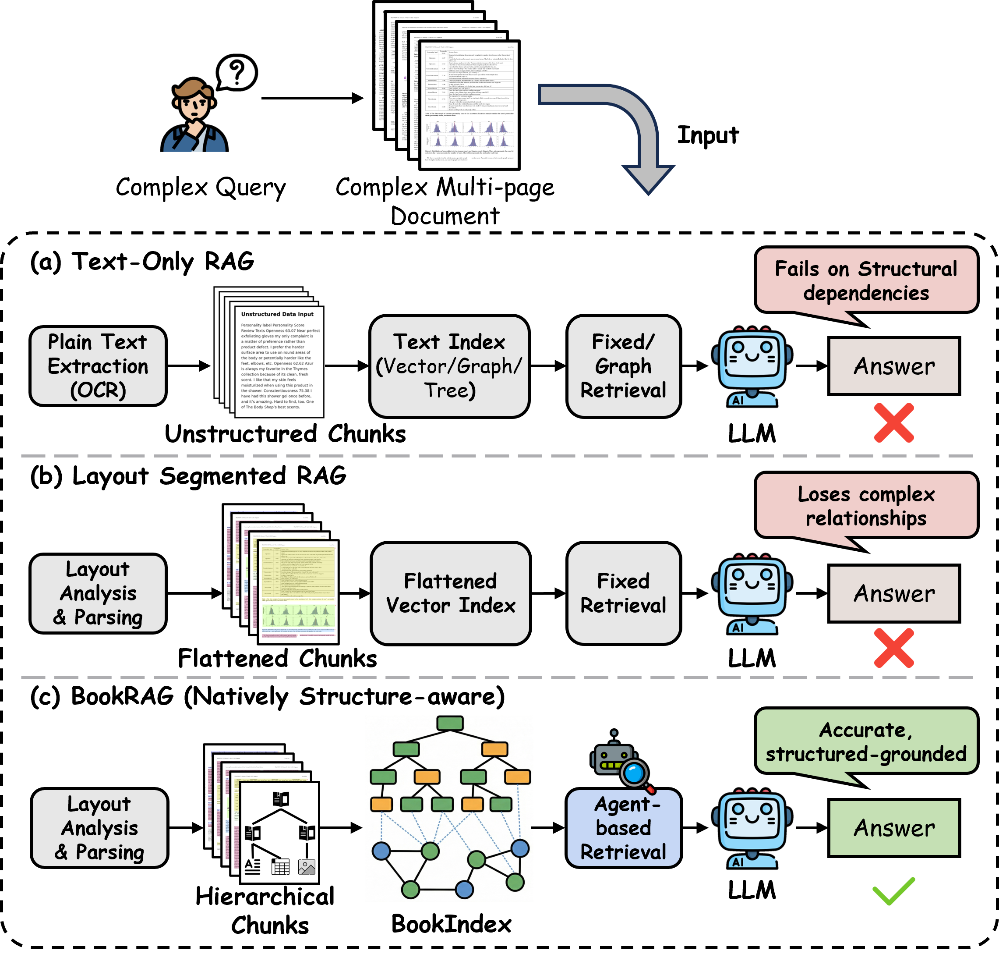
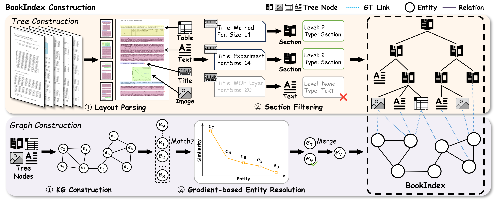
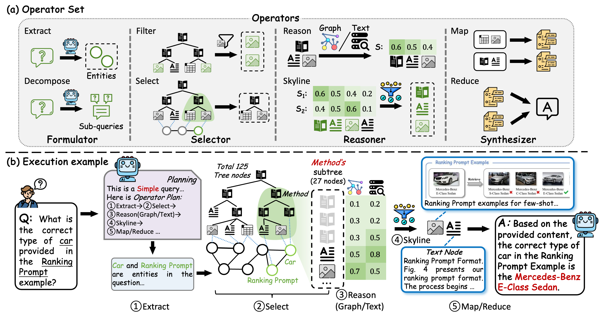

<h1 align="center">BookRAG</h1>

<p align="center">
  <strong>BookRAG: A Hierarchical Structure-aware Index-based Approach for Retrieval-Augmented Generation on Complex Documents</strong>
</p>

<p align="center">
  <a href="https://arxiv.org/abs/2512.03413">
    
  </a>
  <a href="./BOOKRAG_VLDB_2026_full.pdf">
    
  </a>
  <a href="https://github.com/sam234990/BookRAG">
    
  </a>
</p>

> **BookRAG** is the official repository for **"BookRAG: A Hierarchical Structure-aware Index-based Approach for Retrieval-Augmented Generation on Complex Documents"**, accepted by **VLDB 2026**.

BookRAG targets RAG over long, highly structured documents such as books, manuals, handbooks, reports, and technical guidebooks. Instead of flattening documents into isolated text chunks, BookRAG builds a structure-aware **BookIndex** that combines document hierarchies, entity relations, and fine-grained evidence mapping for more effective retrieval and generation.

## News

- **VLDB 2026**: BookRAG has been accepted to VLDB 2026.
- **arXiv**: The preprint is available at [arXiv:2512.03413](https://arxiv.org/abs/2512.03413).
- **Release in progress**: We are preparing the reproducible environment instructions for public use.

## Why BookRAG?

Complex documents are rarely just bags of chunks. They usually contain explicit logical structures, nested chapters, cross-section references, tables, figures, and entity-level dependencies. Conventional RAG pipelines often lose these signals during parsing and indexing.

BookRAG is designed around three ideas:

- **Hierarchy matters**: document trees provide natural navigation paths from coarse chapters to fine evidence.
- **Relations matter**: entity-level graphs capture cross-section dependencies that pure chunk retrieval can miss.
- **Query strategy matters**: different questions require different retrieval workflows, from local lookup to global reasoning.

<p align="center">
  
</p>

<p align="center"><em>Comparison of existing methods and BookRAG for complex document QA.</em></p>

## Method Overview

BookRAG has two stages:

1. **Offline index construction** builds a BookIndex from each document.
2. **Online retrieval and generation** uses the BookIndex to retrieve relevant evidence and answer user questions.

The current implementation supports multiple retrieval configurations and baselines through YAML configuration files under [`config`](./config) and dataset configuration files under [`Scripts/cfg`](./Scripts/cfg).

### BookIndex Construction

BookRAG first constructs a document-native BookIndex by combining a hierarchical document tree, an entity-relation graph, and mappings between entities and document tree nodes.

<p align="center">
  
</p>

<p align="center"><em>The BookIndex construction process.</em></p>

### Agent-based Retrieval

Given a user question, BookRAG performs query classification and planning, then dynamically composes retrieval operators over the BookIndex to locate relevant evidence and generate the final answer.

<p align="center">
  
</p>

<p align="center"><em>The general workflow of agent-based retrieval in BookRAG.</em></p>

## Environment

BookRAG uses [MinerU](https://github.com/opendatalab/MinerU) for PDF parsing and document information extraction. Please install MinerU and its dependencies first if your workflow requires PDF processing.

The complete, reproducible environment for the VLDB 2026 experiments is being prepared and will be released with detailed setup instructions.

## Quick Start

Before running BookRAG, update the following configuration files:

- **System configuration**: model, retriever, embedding, VLM, and runtime settings, for example [`config/default.yaml`](./config/default.yaml)
- **Dataset configuration**: input path, working directory, dataset split, and metadata settings, for example [`Scripts/cfg/example-m3docVQA.yaml`](./Scripts/cfg/example-m3docVQA.yaml)

### Offline Index Construction

Use the example script to construct the BookIndex:

```bash
bash Scripts/example-index.sh
```

### Online Retrieval

Run BookRAG on a configured dataset:

```bash
bash Scripts/example-rag.sh
```

### Evaluation

We use a strong LLM as an answer extractor for evaluating model responses. Please configure the API file before evaluation, for example [`config/api.txt`](./config/api.txt).

```bash
bash Scripts/example-eval.sh
```

## Supported Datasets

BookRAG is evaluated on widely used complex document QA benchmarks:

- **MMLongBench-Doc**: [MMLONGBENCH-DOC](https://github.com/mayubo2333/MMLongBench-Doc)
- **m3docvqa**: [M3DocRAG](https://github.com/bloomberg/m3docrag)
- **Qasper**: [Qasper](https://huggingface.co/datasets/allenai/qasper)

This repository releases the final filtered QA files used in our experiments. The original documents, raw QA files, and dataset-specific metadata should still be obtained from the official dataset repositories above.

| Dataset | Released QA file | Original source |
| --- | --- | --- |
| MMLongBench-Doc | [`datasets/MMLongBench-Doc.json`](./datasets/MMLongBench-Doc.json) | [MMLONGBENCH-DOC](https://github.com/mayubo2333/MMLongBench-Doc) |
| m3docvqa | [`datasets/m3docvqa.json`](./datasets/m3docvqa.json) | [M3DocRAG](https://github.com/bloomberg/m3docrag) |
| Qasper | [`datasets/Qasper.json`](./datasets/Qasper.json) | [Qasper](https://huggingface.co/datasets/allenai/qasper) |

Each released QA file follows the unified JSON format below:

```json
[
  {
    "question": "THE FIRST QUESTION",
    "answer": "THE ANSWER OF FIRST QUESTION",
    "doc_uuid": "UUID OF THE DOCUMENT PDF",
    "doc_path": "PATH_TO_DIR/DOCUMENT.pdf"
  },
  {
    "question": "THE SECOND QUESTION",
    "answer": "THE ANSWER OF SECOND QUESTION",
    "doc_uuid": "UUID OF THE DOCUMENT PDF",
    "doc_path": "PATH_TO_DIR/DOCUMENT.pdf"
  }
]
```

Example preprocessing notebooks and scripts are available in [`Scripts/preprocess`](./Scripts/preprocess).

## Repository Layout

```text
BookRAG/
+-- Core/                 # indexing, retrieval, generation, providers, and configs
+-- Eval/                 # evaluation scripts and answer extraction utilities
+-- Scripts/              # example scripts, dataset configs, and preprocessing notebooks
+-- assets/               # figures and static assets used in the README
+-- config/               # system and method configuration files
+-- datasets/             # filtered QA files used in the paper experiments
+-- BOOKRAG_VLDB_2026_full.pdf
+-- main.py
`-- README.md
```

## Release Plan

We will release reproducible environment instructions for BookRAG.


## Links

- `arXiv`: [2512.03413](https://arxiv.org/abs/2512.03413)
- `Paper PDF`: [BOOKRAG_VLDB_2026_full.pdf](./BOOKRAG_VLDB_2026_full.pdf)
- `Code`: [sam234990/BookRAG](https://github.com/sam234990/BookRAG)

## Citation

If you find BookRAG useful, please cite our paper:

```bibtex
@article{wang2025bookrag,
  title   = {BookRAG: A Hierarchical Structure-aware Index-based Approach for Retrieval-Augmented Generation on Complex Documents},
  author  = {Wang, Shu and Zhou, Yingli and Fang, Yixiang},
  journal = {arXiv preprint arXiv:2512.03413},
  year    = {2025},
  eprint  = {2512.03413},
  archivePrefix = {arXiv},
  url     = {https://arxiv.org/abs/2512.03413}
}
```
